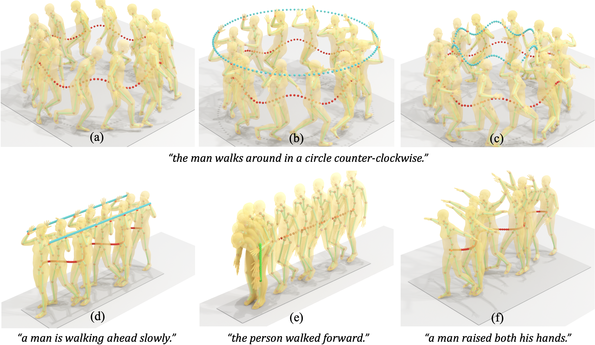

# TLControl
TL_Control: Trajectory and Language Control for Human Motion Synthesis

<div class="section abstract">
	<h2>Abstract</h2><br>
	<div class="row" style="margin-bottom:10px">
		<div class="col" style="text-align:center">
			
		</div>

## Abstract


Controllable human motion synthesis is essential for applications in AR/VR, gaming, movies, and embodied AI. Existing methods often focus solely on either language or full trajectory control, lacking precision in synthesizing motions aligned with user-specified trajectories, especially for multi-joint control. To address these issues, we present TLControl, a new method for realistic human motion synthesis, incorporating both low-level trajectory and high-level language semantics controls. Specifically, we first train a VQ-VAE to learn a compact latent motion space organized by body parts. We then propose a Masked Trajectories Transformer to make coarse initial predictions of full trajectories of joints based on the learned latent motion space, with user-specified partial trajectories and text descriptions as conditioning. Finally, we introduce an efficient test-time optimization to refine these coarse predictions for accurate trajectory control. Experiments demonstrate that TLControl outperforms the state-of-the-art in trajectory accuracy and time efficiency, making it practical for interactive and high-quality animation generation.

## Instructions for Setup and Demo

### 1. Download the SMPL+H Body Model  
Please download the SMPL+H body model from [https://mano.is.tue.mpg.de/](https://mano.is.tue.mpg.de/) and place it in the directory:  
`./body_models/`

### 2. Install Dependencies  
Run the following command to install the necessary dependencies:  
```bash
pip install -r requirements.txt
```

**Note:**  
For demo visualization support, you might also need to install additional libraries through the following command:  
```bash
sudo apt-get install libgl1-mesa-glx libglu1-mesa freeglut3-dev libglib2.0-dev libgl1-mesa-dri libosmesa6-dev
```

### 3. Download Pre-trained Weights  
- **Masked-Trajectory Transformer Weights:** Download from [Google Drive](https://drive.google.com/drive/folders/1YXW33VmX9_QVoKxOl4xkUX4rVhFGVvYc?usp=sharing) and place the file in:  
  `./save_weights/`
  
- **VQ-VAE Pre-trained Weights:** Download from [Google Drive](https://drive.google.com/file/d/1wnHB41x83FmM7MNBmVhE18X6o-VTm2PP/view?usp=sharing) and place the file in:  
  `./save_weights_vq/`

### 4. Run the Demo  
Execute the following command to run the demo:  
```bash
python -m demo.demo
```

### 5. Main Operations  
The core operations of TLControl are located in `./demo/demo.py`.  
We recommend starting with this file to understand how the system works.

## Acknowledgments
We would like to express our gratitude to the following projects, which provided valuable support for this project:

- [Humor](https://github.com/davrempe/humor)
- [T2M-GPT](https://github.com/Mael-zys/T2M-GPT)
- [HumanML3D](https://github.com/EricGuo5513/HumanML3D)
- [Motion Diffusion Model](https://github.com/GuyTevet/motion-diffusion-model)